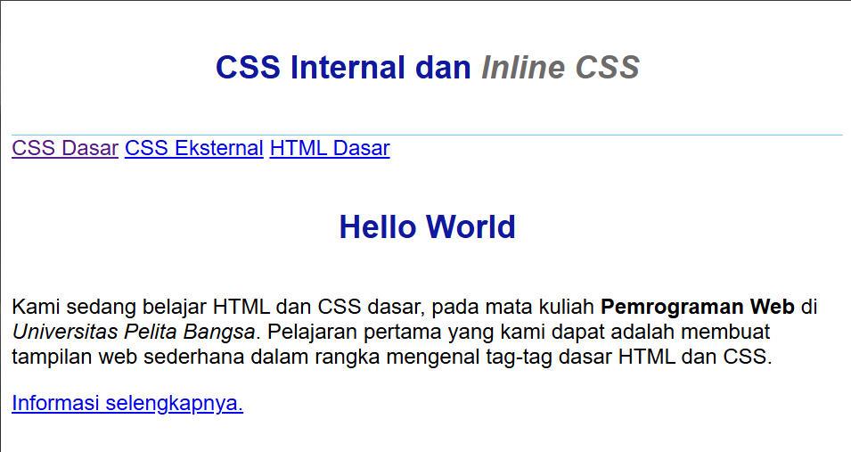
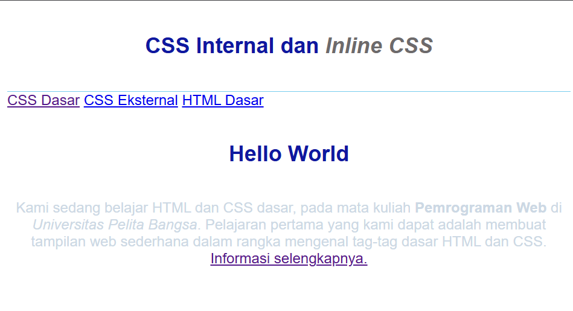
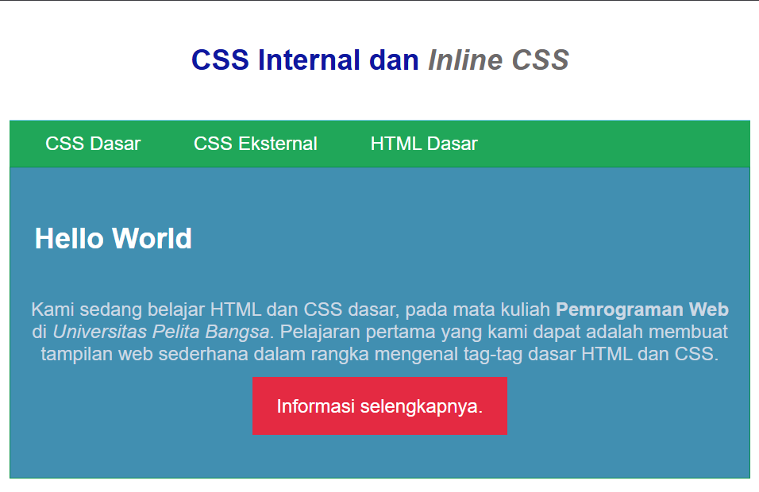
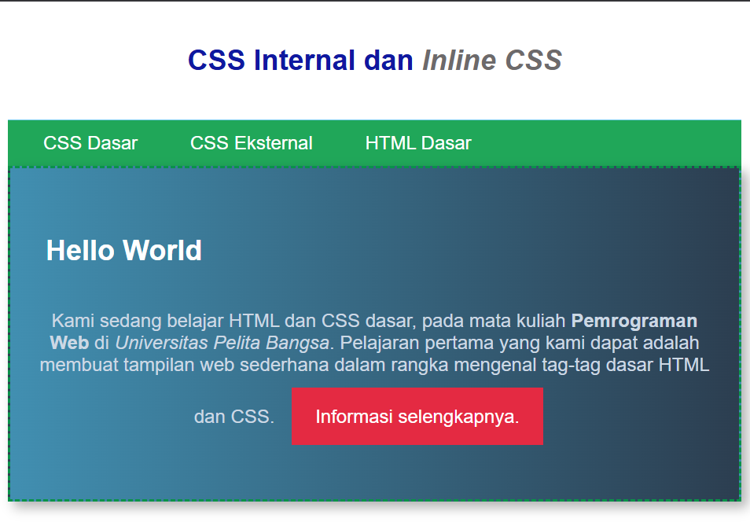

# Lab2Web

## Nama: Syafarudiansya
## NIM: 312410381
## Kelas: TI 24 A6

### Penjelasan Praktikum

1. Mendeklarasikan CSS Internal

CSS internal adalah cara menulis aturan CSS langsung di dalam file HTML dengan menggunakan tag <style> di bagian <head>. Dengan cara ini, styling untuk elemen-elemen di halaman bisa diatur tanpa harus bikin file CSS terpisah.

```html css
<head>
    <title>CSS Dasar</title>
    <style>
        body {
            font-family:'Open Sans', sans-serif;
        }
        header {
            min-height: 80px;
            border-bottom:1px solid #77CCEF;
        }
        h1 {
            font-size: 24px;
            color: #0F189F;
            text-align: center;
            padding: 20px 10px;
        }
        h1 i {
            color:#6d6a6b;
        }
    </style>
</head>
```


2. Menambahkan Inline CSS

Inline CSS adalah cara memberi gaya langsung ke elemen HTML lewat atribut style di dalam tag elemen tersebut. Jadi aturan CSS hanya berlaku pada elemen yang ditulis, bukan ke elemen lain.

```html css
<p style="text-align: center; color: #ccd8e4;">Kami sedang belajar HTML dan CSS dasar, pada mata kuliah <b>Pemrograman
Web</b> di <i>Universitas Pelita Bangsa</i>. Pelajaran pertama yang kami dapat
adalah membuat tampilan web sederhana dalam rangka mengenal tag-tag dasar HTML
dan CSS.</>
```


3. Membuat CSS Eksternal

CSS eksternal artinya aturan gaya (style) disimpan di file terpisah, misalnya style.css, lalu dipanggil ke dalam file HTML dengan `<link rel="stylesheet" href="style.css">` di bagian <head>. Jadi, HTML hanya berisi struktur konten (judul, paragraf, gambar, navigasi, dll), sementara file CSS khusus mengatur tampilannya (warna, ukuran, posisi, margin, padding, dsb).

```html
<head>
<link rel="stylesheet" href="style_eksternal.css" type="text/css">
</head>
```
Isi css eksternal:

```css
nav {
    background: #20A759;
    color:#fff;
    padding: 10px;
}
nav a {
    color: #fff;
    text-decoration: none;
    padding:10px 20px;
}
nav .active,
nav a:hover {
    background: #0B6B3A;
}
```


4. Menambahkan CSS Selector

CSS Selector dipakai untuk memilih elemen HTML agar bisa diberi gaya. ID Selector `#` digunakan untuk elemen unik dalam halaman, sedangkan Class Selector `.` bisa dipakai berulang kali pada banyak elemen sehingga lebih fleksibel.

```css
#intro {
background: #418fb1;
border: 1px solid #099249;
min-height: 100px;
padding: 10px;
}
#intro h1 {
text-align: left;
border: 0;
color: #fff;
}
/* Class Selector */
.button {
padding: 15px 20px;
background: #bebcbd;
color: #fff;
display: inline-block;
margin: 10px;
text-decoration: none;
}
.btn-primary {
background: #E42A42;
}
```


### Pertanyaan dan Tugas

1. Lakukan eksperimen dengan mengubah dan menambah properti dan nilai pada kode CSS
dengan mengacu pada CSS Cheat Sheet yang diberikan pada file terpisah dari modul ini.
```css
#intro {
  background: linear-gradient(to right, #418fb1, #2c3e50);
  border: 2px dashed #099249;
  min-height: 150px;
  padding: 20px;
  color: white;
  font-family: Arial, sans-serif;
  text-align: center;
  box-shadow: 5px 5px 10px rgba(0,0,0,0.3);
}
```


2. Apa perbedaan pendeklarasian CSS elemen h1 {...} dengan #intro h1 {...}? berikan
penjelasannya!
Selector h1 {} berlaku untuk semua elemen `<h1>`, sedangkan `#intro h1 {}` hanya berlaku untuk `<h1>` di dalam elemen dengan `id="intro"`, dan karena lebih spesifik maka #intro h1 akan menang jika ada konflik.

3. Apabila ada deklarasi CSS secara internal, lalu ditambahkan CSS eksternal dan inline CSS pada
elemen yang sama. Deklarasi manakah yang akan ditampilkan pada browser? Berikan
penjelasan dan contohnya!
Prioritas CSS adalah inline > internal/eksternal tergantung urutan > selector paling spesifik. Jadi inline style selalu mengalahkan yang lain, lalu aturan terakhir dengan spesifisitas lebih tinggi yang dipakai. Contoh: jika `<h1 id="judul" style="color: red;">` dan di file CSS eksternal ada `#judul { color: blue; }` maka warna yang terlihat tetap merah karena inline menang.

4. Pada sebuah elemen HTML terdapat ID dan Class, apabila masing-masing selector tersebut
terdapat deklarasi CSS, maka deklarasi manakah yang akan ditampilkan pada browser?
Berikan penjelasan dan contohnya! ( <p id="paragraf-1" class="text-paragraf"> )
Jika elemen punya ID dan class, maka deklarasi ID akan menang atas class karena spesifisitas ID lebih tinggi. Jadi `#paragraf-1 {}` akan mengoverride `.text-paragraf {} `bila properti yang sama didefinisikan. Contoh: untuk elemen `<p id="paragraf-1" class="text-paragraf">`, jika CSS berisi .text-paragraf { font-size: 14px; color: black; } dan #paragraf-1 { color: green; } maka teks akan berukuran 14px dan berwarna hijau karena aturan color dari ID mengalahkan color dari class.
